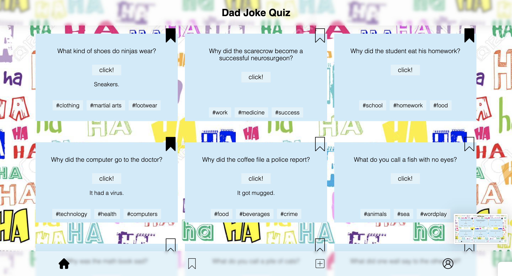

## Local development

To run project commands locally, you need to install the dependencies using `npm i` first.

You can then use the following commands:

- `npm run dev` to start the development server
- `npm run build` to create a production build
- `npm run start` to start the production build\*\*

## Technologies

## Home page

## Bookmarking

## Submit jokes

